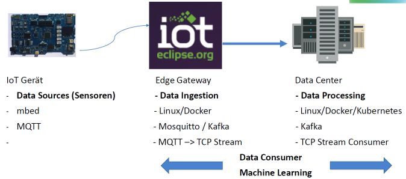
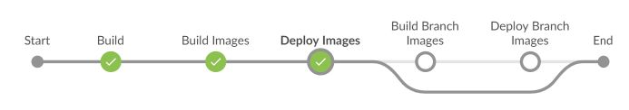

Beispiele: [Digicomp DevDay 2018](https://www.digicomp.ch/events/development-events/devday-2018)
=============================================================================================

### Quick Start

Installiert [Git/Bash](https://git-scm.com/downloads), [Vagrant](https://www.vagrantup.com/) und [VirtualBox](https://www.virtualbox.org/).

Projekt [lernkube](https://github.com/mc-b/lernkube), auf der Git/Bash Kommandozeile (CLI), klonen, Konfigurationsdatei (.yaml) kopieren und Installation starten. 

	git clone https://github.com/mc-b/lernkube
	cd lernkube
	cp templates/DevDay.yaml config.yaml
	vagrant plugin install vagrant-disksize
	vagrant up

Nach der Installation: öffnet die Interaktive Lernumgebung mit dem Machine Learning Beispiel [http://localhost:32088/notebooks/02-2-MLTempHumSensor.ipynb](http://localhost:32088/notebooks/02-2-MLTempHumSensor.ipynb) und spielt das Beispiel, mittels `Run` durch.

### Aufbau einer Internet of Things – Machine Learning Fast Data Pipeline mit Docker/Kubernetes
***

[Slides](slides/IoT-ML-MS.pdf)

- - - 

#### Folie 10 - IoT Gerät Programmieren

* IoTKit V3 via USB anschliessen, neues Laufwerk (Mountpoint) wird angezeigt
* mbed.htm Doppelklicken, [os.mbed.com](http://os.mbed.com) Website wird anzeigt
* Wechsel auf [MQTTPublish Repository](https://os.mbed.com/teams/IoTKitV3/code/MQTTPublish/) und `Import into Compiler` drücken
* mbed Compiler wird gestartet und Programm [MQTTPublish] in Compiler Umgebung importiert
* Evtl. WLAN (SSID/PW) Daten in `mbed_app.json` und ggf. `host` und `port` in `main.cpp` anpassen
* Programm mittels `Compile` Übersetzen in Maschinensprache und `MQTTPublish.bin`-Datei auf Laufwerk `DAPLINK` speichern und `Reset` Button auf IoTKit V3 drücken
* Das IoTKit V3 sendet Temperatur und Luftfeuchtigkeitsdaten an einen MQTT Broker
* Umgebung mit Installierter `mosquitto-clients` Tools starten, z.B. `Bash`
* MQTT Daten mittels `mosquitto_sub -t 'iotkit/#' -h iot.eclipse.org` anzeigen lassen.

#### Folie 15 - ML/IoT (02-2-MLTempHumSensor)

* Jupyter Notebook, mit Machine Learning / IoT Beispiel mittels [http://localhost:32088/notebooks/02-2-MLTempHumSensor.ipynb](http://localhost:32088/notebooks/02-2-MLTempHumSensor.ipynb) aufrufen und durcharbeiten mit `Run`.

#### Folie 21 - Docker und Kubernetes

OS Ticket, als ein Beispiel für die Ausbildung an Berufschulen zeigen.

	kubectl apply -f duk/osticket
	startsrv osticket
	kubectl delete -f duk/osticket

Hinweis auf [lernkube](https://github.com/mc-b/lernkube).

#### Folie 29 - Fast Data Pipeline

Edge und Data Center: starten Mosquitto, Kafka, MQTT-Bridge, Streams und Consumer Beispiel

	kubectl apply -f devday/iotmldata/
	
Weitere Möglichkeiten und Sourcecode auf https://github.com/mc-b/duk/tree/master/kafka#kafka-mit-mqtt-bridge und https://github.com/mc-b/iot.kafka.git.

Kontrollieren im Dashboard Logs der Pods iot-kafka-* anschauen, mittels Weave oder 

	logs iot-kafka-consumer
	logs iot-kafka-pipe
	
Weave Oberfläche mittels `weave` in Bash starten und Verbindungen zeigen.

#### Folie 30 - IoT und Prozesse

Camunda BPMN Workflow Engine starten

	kubectl apply -f misegr/bpmn/camunda.yaml
	
Camunda BPMN Oberfläche (Tasklist) aufrufen [https://localhost:30443/camunda](https://localhost:30443/camunda), Anmelden mit `demo/demo`. Es sollten nur zwei Task offen sein.

BPMN Prozess veröffentlichen 	

	cd misegr/bpmn/
	curl -k -w "\n" \
	-H "Accept: application/json" \
	-F "deployment-name=rechnung" \
	-F "enable-duplicate-filtering=true" \
	-F "deploy-changed-only=true" \
	-F "Rechnung.bpmn=@RechnungStep3.bpmn" \
	https://localhost:30443/engine-rest/deployment/create

Magnet an Hallsensor auf IoTKit anlegen und warten bis `alert` auf Display erscheint und LED 13 leuchtet.

Wechsel in BPMN Oberfläche (Tasklist). Es ist eine neue Task erstellt worden.

### Aufbau einer Continous Integration / Delivery Pipeline mit Docker/Kubernetes
***

[Slides](slides/CI_CD_DUK.pdf)

- - - 

#### Folie 9 - Docker und Kubernetes

OS Ticket, als ein Beispiel für die Ausbildung an Berufschulen zeigen.

	kubectl apply -f duk/osticket
	startsrv osticket
	kubectl delete -f duk/osticket
	
#### Folie 16 - CI / CD Tools

Tools starten

	kubectl apply –f devday/devops/
	
**SW Entwicklung**

* Planen
    * [Kanboard](http://localhost:32200) Aufrufen, Anmelden mit `admin/admin`
    * Projekt ["Aufbau CI/CD"](http://localhost:32200/?controller=BoardViewController&action=show&project_id=1&search=status%3Aopen) zeigen.
* Versionsverwaltung (Git Repository) einrichten
    * [Gogs](http://localhost:32300) Aufrufen, Anmelden mit `root/xxx`
    * "+" Erstellen -> Neue Migration
	* https://github.com/bernet-tbz/bpmn-tutorial.git Repository übernehmen
* Sourcen um CI/CD Konfiguration ergänzen (Jenkingsfile).
	* [Jenkinsfile]() Zeigen und Kontrollieren
* Neue Pipeline in Jenkins  anlegen
	* [Jenkins](http://localhost:32100) Aufrufen, Anmelden mit `admin/admin`
	* Wechseln auf "Open Blue Ocean" 
	* "Create new Pipeline" ab Git und mit URL [http://localhost:32300/root/bpmn-tutorial.git](http://localhost:32300/root/bpmn-tutorial.git)
	* Nach erfolgreicher Abarbeitung der Jenkins Pipeline
	* Neu erstellte Applikation [bpmn-frontend](https://localhost:30443/frontend/index.html) Aufrufen.	
	* Dashboard in der `Bash` mit `dashboard` starten, Kontrollieren ob ein Pod `bpmn-frontend` läuft.	
	
#### Folie 18 - Rolling Update

Image auf neue Version setzen:

	kubectl set image deployment/bpmn-frontend bpmn-frontend=misegr/bpmn-frontend:V1.0
		
Es wird automatisch ein Rolling Update durchgeführt.

Änderungen Verfolgen mittels:

	kubectl rollout status deployment/bpmn-frontend
	kubectl describe deployment/bpmn-frontend

#### Folie 22 - CI/CD Rolling Update

Alte BPMN-Services wegräumen

	kubectl delete -f misegr/bpmn/
	
Und in [Jenkins](http://localhost:32100) Pipeline löschen.

[Gogs](http://localhost:32300) Aufrufen, `bpmn-frontend/index.html` Ändern und beim Neuen Branch `V1.1` anlegen.

In [Jenkins](http://localhost:32100) Pipeline wieder anlegen. Es wird für `master` und `V1.1` eine Pipeline erzeugt.

Bei jedem Neuen Starten der `V1.1` Pipeline, wird ein neues Docker Image mit Version `V1.1.${BUILD_NUMBER}` erstellt.

#### Folie 23 - Kanboard Task Updaten

[Gogs](http://localhost:32300) kann Änderungen in Repository, bzw. dessen Kommentar an [Kanboard](http://localhost:32200) weitergeben.

* Im [Kanboard](http://localhost:32200)
	* Rechts -> Plug-Ins -> Gogs Webhooks Plug-In installieren
	* Auf dem Projekt -> Zahnrad (links) -> Projekteinstellungen -> Automatische Aktionen -> Kommentar eines externen Providers hinzufügen -> Gogs
	* Auf dem Projekt -> Zahnrad (links) -> Projekteinstellungen -> Integration -> Webhooks URL kopieren.

* In [Gogs](http://localhost:32300)
	* Repository -> Einstellungen -> Webhooks hinzufügen -> Gogs -> Payload URL = Webhooks URL von Kanboard, Feld "Secrets" leer lassen.
	* Repository -> Eine Datei bzw. dessen Inhalt verändern und beim Kommentar z.B. "Zu Besprechen #8" eingeben. 
	* #8 Entspricht der Tasknummer in Kanboard. 	

Details siehe: https://github.com/kanboard/plugin-gogs-webhook 

